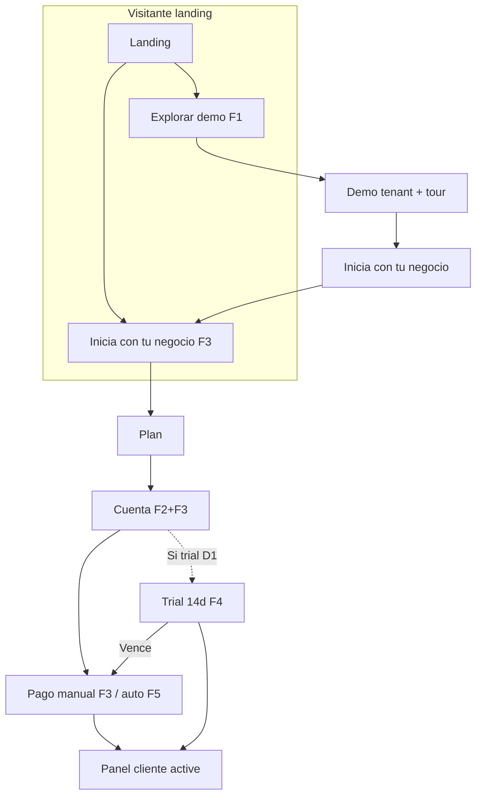

# Plan maestro por fases — Demo guiada, registro y suscripción

**Documento único** para desarrollar Azenda paso a paso antes de escribir código en bloque.  
Define **qué construir**, **en qué orden** y **cómo probar** cada entrega.

**Origen:** revisión producto/negocio (junio 2026).  
**Relacionado:** [PLANES_Y_FACTURACION.md](PLANES_Y_FACTURACION.md), [PLAN_MEJORAS_FASES.md](PLAN_MEJORAS_FASES.md), [PRUEBAS_SISTEMA.md](PRUEBAS_SISTEMA.md).

Marca progreso: `[ ]` pendiente · `[x]` hecho · `[-]` en curso.

---

## 1. Visión del producto

### Tres caminos distintos (no mezclar)

| Camino | Usuario | Objetivo | ¿Paga? |
|--------|---------|----------|--------|
| **A. Showroom demo** | Visitante en landing | Ver **todas** las funciones en un negocio de ejemplo, **guiado** | No |
| **B. Trial** (opcional, Fase 5) | Negocio registrado | Probar **su** negocio 14 días (solo plan Básico / citas) | Al vencer |
| **C. Cliente de pago** | Registro + suscripción | Operación real según plan | Sí |

### Reglas de negocio acordadas

1. **Demo ≠ cuenta real.** Un tenant fijo; **catálogo base fijo** (≥5 servicios y ≥5 productos) + **reset semanal** del resto (citas, ventas, extras).
2. **Registro ≠ acceso gratis ilimitado.** Sin pago/trial activo → sin panel operativo.
3. **Demo muestra Pro/Negocio completo;** el cliente de pago solo ve lo de **su plan**.
4. **Siempre visible:** botón **«Inicia con tu negocio»** → funnel `/contratar`.
5. **Funnel tipo Netflix** (plan → cuenta → pago → panel); cobro **automático** en fase avanzada.
6. **Reset semanal del demo** para no saturar Neon con datos de prueba.

### Problema actual (junio 2026)

| Comportamiento | Riesgo |
|----------------|--------|
| Registro crea tenant `ACTIVE` con acceso operativo | Cliente gratis sin pagar |
| Landing «Empezar gratis» | Expectativa incorrecta |
| Demo dispersa (`barberia-centro`, mock, seed) | No hay recorrido guiado único |
| Sin `subscription_status` | No hay estado «pendiente de pago» |

### Corrección parcial ya hecha

- Registro API: plan `Trial` con **solo módulo citas** (`plan-modules.ts`). **Insuficiente** sin gate de pago.

---

## 2. Mapa de fases (orden de ejecución)

```text
Fase 0   Preparación y decisiones
   ↓
Fase 1   Showroom demo guiado + reset semanal     ← EMPEZAR AQUÍ (producto visible)
   ↓
Fase 2   Cerrar agujero: registro sin acceso operativo
   ↓
Fase 3   Funnel /contratar (UX Netflix, pago manual)
   ↓
Fase 4   Trial 14 días (opcional, si D1 lo confirma)
   ↓
Fase 5   Cobro automático (pasarela COP)
   ↓
Fase 6   Comunicación, onboarding cliente real
   ↓
Fase 7   Renovaciones, mora, upgrades
```

| Fase | Nombre corto | Entregable clave | Estado |
|------|--------------|-----------------|--------|
| **0** | Preparación | Decisiones + auditoría cuentas | `[-]` |
| **1** | **Demo guiada** | Tenant fijo, tour, reset semanal, CTA negocio | `[ ]` |
| **2** | Gate registro | `pending_payment`, no `/app` sin activar | `[ ]` |
| **3** | Funnel Netflix | `/contratar/*`, activación manual | `[ ]` |
| **4** | Trial | 14 días Básico (opcional) | **HOLD** |
| **5** | Pasarela | Cobro automático + webhook | `[ ]` |
| **6** | Comms | Emails, onboarding post-pago | `[ ]` |
| **7** | Lifecycle | Mora, renovación, upgrades | `[ ]` |

---

## 3. Decisiones de producto

| # | Pregunta | Propuesta | Decisión final |
|---|----------|-----------|----------------|
| D1 | ¿Trial además de demo? | Demo **siempre**; trial **14 días Básico** en Fase 4 (opcional) | **PENDIENTE** |
| D2 | Cobro inicial (piloto) | Manual transferencia/Nequi → Fase 5 automático | **PENDIENTE** |
| D3 | Plan Básico | Solo **citas** (como landing) | **PENDIENTE** |
| D4 | Cuentas legacy sin pago | Auditar → pausar o excepción comercial | **Acordado:** dejarlas como están (todas son pruebas); borrado manual más adelante para validar eliminación de cuentas |
| D5 | CTAs landing | **Explorar demo** + **Inicia con tu negocio** + Ver planes | **Acordado** |
| D6 | Reset demo | **Semanal** (domingo 03:00 UTC-5 o cron manual); **no** borra el catálogo base | **Acordado** |
| D8 | Catálogo demo permanente | **Mín. 5 servicios + 5 productos** fijos (`is_demo_core`); no se resetean | **Acordado** |
| D9 | Vista empleado en demo | Entrada **admin** + switch **«Ver como empleado»** en banner (sin nueva contraseña) | **Acordado** |
| D7 | Permisos en demo | **Todo** como usuario completo, solo en tenant demo | **Acordado** |

---

## 4. Matriz planes ↔ módulos (clientes de pago)

Fuente única: `api/src/infrastructure/sql-db/plan-modules.ts` + catálogo.

| Plan | Citas | Ventas | Inventario |
|------|:-----:|:------:|:----------:|
| **Básico** | ✅ | ❌ | ❌ |
| **Pro** | ✅ | ✅ | ❌ |
| **Negocio** | ✅ | ✅ | ✅ |
| **Showroom demo** | ✅ | ✅ | ✅ | *(solo tenant `azenda-demo`, no es plan comercial)* |

---

# FASE 0 — Preparación

**Objetivo:** alinear equipo y datos antes de codear Fase 1.

### Paso 0.1 — Cerrar decisiones

- [ ] Reunión producto: confirmar D1, D2, D3 en tabla §3 (D4 ya cerrado)
- [ ] Redactar instrucciones de pago manual (texto para Fase 3)
- [ ] Definir SLA: «Activamos en X horas hábiles tras comprobante»

### Paso 0.2 — Auditoría técnica

- [x] Política cuentas existentes (D4): **no pausar ni migrar** — son pruebas; eliminación manual futura
- [ ] Listar tenants de prueba (referencia opcional antes del borrado manual)
- [ ] Separar seed demo (`barberia-centro`, `azenda-demo` futuro) vs cuentas de prueba self-service

### Paso 0.3 — Documentación

- [x] Este plan maestro
- [ ] Añadir escenarios demo + registro a `PRUEBAS_SISTEMA.md` (al cerrar Fase 1 y 2)

**Criterio de salida Fase 0:** D3 cerrado; D4 cerrado (cuentas prueba sin tocar). Lista de tenants opcional para borrado manual futuro.

---

# FASE 1 — Showroom demo guiado (prioridad)

**Objetivo:** negocio demo **fijo**, visitante hace **de todo** como usuario completo, con **tutorial por sección**, **reset semanal** y CTA **«Inicia con tu negocio»**.

### 1.1 Concepto del showroom

| Atributo | Valor |
|----------|-------|
| Tenant ID | `tenant_azenda_demo` |
| Slug reserva | `azenda-demo` → `/reservar/azenda-demo` |
| Nombre visible | «Barbería Azenda Demo» (o similar) |
| Plan simulado | Negocio (todos los módulos) |
| Flag BD | `is_demo_tenant = true` |
| Usuarios demo | `demo-admin@azenda.dev` (ADMIN), `demo-empleado@azenda.dev` (EMPLEADO) — **permanentes** |
| Vista por defecto | **Administrador**; switch a empleado en banner (D9) |
| Escritura | **Permitida** dentro del tenant demo |
| Reset | **Semanal** del dato volátil; **catálogo base permanece** (ver §1.3–1.4) |

### 1.2 Flujo del visitante

```mermaid
flowchart TD
  L[Landing] -->|Explorar demo| E[POST /auth/demo-session]
  E --> W[Modal bienvenida + reglas]
  W --> T[Tour: checklist 7 paradas]
  T --> P[Panel /app como admin demo]
  P --> EMP{¿Ver como empleado?}
  EMP -->|Switch banner| P2[Panel vista empleado]
  EMP -->|Sigue tour admin| R
  P2 --> R
  P --> R[Parada: reserva pública nueva pestaña]
  R --> CTA[Botón fijo: Inicia con tu negocio]
  CTA --> F[/contratar]
```

### 1.3 Catálogo permanente + datos de ejemplo (D8)

El demo debe **siempre** tener información suficiente para probar citas, ventas, inventario y reserva pública. Por eso el **catálogo base no se resetea**.

#### Núcleo permanente (mínimo 5 + 5)

Marcar en BD con flag `is_demo_core = true` (o IDs fijos en snapshot):

| Tipo | Mínimo | Ejemplos | ¿Se resetea? |
|------|--------|----------|--------------|
| **Servicios** | **5** | Corte clásico, fade, corte+barba, arreglo barba, peinado | **No** |
| **Productos** | **5** | Cera, shampoo, gel, aceite barba, tinte | **No** |
| Branding | 1 | Logo, colores, WhatsApp, horario L–S | **No** |
| Empleados demo | 2 usuarios | `demo-admin` (ADMIN), `demo-empleado` (EMPLEADO, ej. «Laura Demo») | **No** |

Con 5 servicios el visitante prueba: agenda, duraciones, reserva pública, promos opcionales.  
Con 5 productos prueba: inventario, stock, ventas POS, alertas stock bajo.

#### Dato volátil (sí se resetea semanalmente)

| Dominio | Comportamiento en reset |
|---------|-------------------------|
| Citas creadas por visitantes | Borrar y reinsertar ~8 citas ejemplo (ver abajo) |
| Ventas registradas en demo | Borrar y reinsertar 3–4 ejemplo |
| Movimientos de stock (no core) | Borrar extras; **restaurar stock** de los 5 productos core al valor seed |
| Servicios/productos **añadidos** por visitantes (`is_demo_core = false`) | **Eliminar** |
| Servicios/productos **core** | **Mantener**; opcional: restaurar nombre/precio/stock al valor seed si alguien los editó |

Guardar definición en **`api/scripts/demo-tenant.snapshot.ts`**: bloque `coreCatalog` (10 ítems fijos) + bloque `volatileSample` (citas, ventas, etc.).

#### Citas de ejemplo para vista empleado (volatileSample)

Al reinsertar citas tras el reset, incluir **asignación de profesional** (`demo-empleado` user id) para que la vista empleado no quede vacía:

| Cita ejemplo | Asignada a | Visible en vista empleado |
|--------------|------------|---------------------------|
| ≥3 citas | `demo-empleado` | **Sí** |
| ≥2 citas | otro profesional / sin asignar a empleado | **No** (demuestra el filtro) |

Misma regla que producción: en `/app/citas` el empleado solo ve citas con su `userId` en el servicio.

### 1.4 Reset semanal (D6) — reset parcial

**Por qué:** visitantes crean citas, ventas y productos extra → sin reset, Neon crece. El **catálogo base** queda para que el demo siempre se vea completo.

| Aspecto | Detalle |
|---------|---------|
| Frecuencia | Cada **domingo 03:00** America/Bogota (configurable) |
| Mecanismo | Job Nest `@Cron` o `npm run demo:reset` |
| **No tocar** | `is_demo_tenant`, usuarios demo (**admin + empleado**), slug, **≥5 servicios core**, **≥5 productos core**, branding |
| **Sí resetear** | Citas, ventas, movimientos extra, ítems de catálogo no-core |
| **Opcional** | Reaplicar precios/stock de ítems core si fueron editados en la semana |
| Log | `demo_reset_log`: filas borradas, ítems core preservados |
| Manual | Super-admin «Reset demo ahora» (misma lógica parcial) |

```text
resetDemoTenant():
  1. DELETE appointments, sales, store_visits WHERE tenant = demo
  2. DELETE catalog items WHERE tenant = demo AND is_demo_core = false
  3. DELETE stock_movements WHERE tenant = demo (o solo no asociados a core)
  4. REINSERT volatileSample (citas/ventas de ejemplo)
  5. RESTORE core products stock/prices from snapshot (opcional)
  6. NEVER DELETE services/products WHERE is_demo_core = true
```

#### Tareas reset

- [ ] Columna `is_demo_tenant` en `tenants`
- [ ] Columna `is_demo_core` en servicios/productos del tenant demo (o tabla de IDs core)
- [ ] Seed: **exactamente ≥5** servicios y **≥5** productos con `is_demo_core = true`
- [ ] Función `resetDemoTenantPartial()` (no full wipe)
- [ ] Cron semanal + `POST /admin/demo/reset`
- [ ] Test: tras reset siguen existiendo ≥5 servicios y ≥5 productos core; citas/ventas extras borradas
- [ ] Documentar en `PRUEBAS_SISTEMA.md`

### 1.5 Entrada sin registro

#### Sesión demo por API (admin por defecto)

```http
POST /api/auth/demo-session
Body (opcional): { "role": "admin" | "employee" }
→ JWT: tenantId = tenant_azenda_demo, claim isDemoShowcase: true
→ role admin  → usuario demo-admin@azenda.dev (UserRole.ADMIN → TENANT_ADMIN en front)
→ role employee → usuario demo-empleado@azenda.dev (UserRole.EMPLEADO → EMPLOYEE en front)
→ Rate limit: 10 req / IP / hora
```

- [ ] Endpoint `demo-session` (sin password público)
- [ ] Body opcional `role`; default **`admin`**
- [ ] JWT claim `isDemoShowcase: true`
- [ ] Guard: sesión demo **solo** tenant `tenant_azenda_demo`
- [ ] Ruta front `/demo` → `demo-session` con `admin` → `/app/panel?tour=start`

### 1.5b Vista empleado — switch en banner (D9)

**Objetivo:** en un mismo recorrido, el visitante compara **admin** vs **empleado** sin registrarse ni usar otra contraseña.

#### Comportamiento en producción (referencia)

| Módulo | Admin | Empleado |
|--------|:-----:|:--------:|
| Resumen | Todo | Solo sus citas |
| Citas | Todas | Filtradas |
| Ventas | Sí | Sí |
| Inventario / catálogo | Editar | Ver / ventas; edición catálogo solo admin en API |
| Empleados | Sí | **No** (guard → `/app/panel`) |
| Configuración / plan | Sí | **No** |

#### UI en banner demo

```text
┌──────────────────────────────────────────────────────────────────────────────┐
│ 🎯 Modo demo · Vista: [ Administrador ▼ | Empleado (Laura) ]                  │
│    Citas/ventas se reinician cada semana · catálogo base permanece.          │
│    Vista: [ Administrador | Empleado ]  ·  [Inicia con tu negocio]  [Salir]   │
└──────────────────────────────────────────────────────────────────────────────┘
```

Al cambiar vista:

1. `POST /api/auth/demo-session` con `{ "role": "employee" }` o `{ "role": "admin" }`
2. Reemplazar JWT en sesión (`MockSessionService` / `persistAuth`)
3. Recargar contexto tenant (`tenantContext`)
4. Si estaba en `/app/empleados` o `/app/configuracion` y pasa a empleado → redirect `/app/panel`
5. Toast breve: «Ahora ves el panel como empleado (Laura Demo)»

#### Integración con el tour (parada 5)

| Sub-paso | Rol | Acción |
|----------|-----|--------|
| 5a | Admin | Pantalla `/app/empleados` — «Aquí gestionas equipo y roles» |
| 5b | — | CTA en tour: **«Probar vista empleado»** → switch `employee` |
| 5c | Empleado | Mini-tour (2 pasos): `/app/panel` (resumen filtrado) + `/app/citas` (solo sus citas) |
| 5d | — | CTA: **«Volver a administrador»** → switch `admin`; continuar parada 6 |

#### Tareas vista empleado

- [ ] Seed `demo-empleado@azenda.dev` con nombre visible «Laura Demo» (o similar)
- [ ] `demo-session` acepta `role: admin | employee`
- [ ] Componente `demo-role-switch` en banner (select o dos botones)
- [ ] Front: mapear `EMPLEADO` → `EMPLOYEE` en sesión (ya existe en login mock)
- [ ] `volatileSample`: ≥3 citas asignadas a empleado demo
- [ ] Tour parada 5: sub-pasos 5a–5d
- [ ] Test: switch a empleado oculta menú empleados/config; citas filtradas

#### Limitaciones demo empleado

- No puede abrir gestión de empleados ni configuración (igual que cliente real).
- No demuestra creación de productos/servicios core (solo admin); opcional: mensaje API 403 educativo.
- El switch no crea cuenta nueva: misma sesión showcase, otro JWT.


### 1.6 UI — banner y CTA permanente

En **tenant-shell** cuando `isDemoShowcase()`:

```text
┌──────────────────────────────────────────────────────────────────────────┐
│ 🎯 Modo demo · Citas/ventas se reinician cada semana.                    │
│    ≥5 servicios y ≥5 productos base permanecen para probar todo.         │
│    [Inicia con tu negocio]  [Salir del demo]                             │
└──────────────────────────────────────────────────────────────────────────┘
```

- [ ] Banner sticky + **switch vista admin / empleado** (§1.5b)
- [ ] Botón primario **«Inicia con tu negocio»** → `/contratar`
- [ ] Botón secundario «Salir del demo» → logout + landing
- [ ] Ocultar acciones destructivas irrelevantes (borrar tenant, cambiar plan comercial)

### 1.7 Tour guiado (7 paradas)

Servicio: `DemoTourService` + componente `demo-tour-card` (estilo `az-card`, no librería externa en v1).

| # | Ruta | Título tour | Pasos (1–3 bullets) |
|---|------|-------------|---------------------|
| 1 | `/app/panel` | Tu resumen | KPIs, citas del día, alertas stock |
| 2 | `/app/citas` | Agenda | Calendario, estados, asistencia, WA |
| 3 | `/app/ventas` | Ventas | Registrar venta, métodos de pago POS |
| 4 | `/app/inventario` | Catálogo e inventario | Servicios, productos, stock bajo |
| 5 | `/app/empleados` | Equipo (solo admin) | Roles; luego **«Probar vista empleado»** (§1.5b) |
| 5b | `/app/panel` + `/app/citas` | Vista empleado | Resumen y agenda filtrados |
| 6 | `/app/configuracion` | Configuración | Horario, enlace reserva, branding |
| 7 | Externa | Reserva pública | Abrir `/reservar/azenda-demo`, flujo cliente |

**UX tour**

- Panel lateral o drawer: checklist con ✓ al completar parada
- Al entrar en ruta: card flotante «Paso X de 7» + **Siguiente** / **Saltar tour**
- Progreso en `localStorage`: `azenda.demo.tour.v1`
- Al terminar parada 7: modal «¿Listo para tu negocio?» + CTA **Inicia con tu negocio**

#### Tareas tour

- [ ] `demo-role-switch` en banner
- [ ] `DemoTourService` — parada 5 con sub-pasos empleado
- [ ] `demo-tour-drawer.component` (checklist)
- [ ] `demo-tour-step-card.component` (card contextual)
- [ ] Integrar en cada página tenant (1 hook por vista)
- [ ] Parada 7 abre reserva en `target=_blank`

### 1.8 Landing — CTAs

| Zona | Botón | Destino |
|------|-------|---------|
| Hero secundario | **Explorar demo interactiva** | `/demo` |
| Hero primario | **Inicia con tu negocio** | `/contratar` |
| Sección planes | **Continuar con [plan]** | `/contratar/basico` etc. |
| Nav | Iniciar sesión | `/auth/iniciar-sesion` |

Quitar o reemplazar **«Empezar gratis»**.

- [ ] Actualizar `landing-page.component.html`
- [ ] Hero: dos CTAs claros (demo vs contratar)

### 1.9 Archivos a crear / modificar (Fase 1)

| Área | Archivo / carpeta |
|------|-------------------|
| API seed | `api/scripts/demo-tenant.snapshot.ts`, bootstrap |
| API reset | `api/src/demo/demo-reset.service.ts`, cron |
| API auth | `api/src/auth/demo-session.controller.ts` |
| Front demo | `src/app/features/demo/` (entry `/demo`) |
| Front tour | `src/app/features/demo-tour/` + `demo-role-switch` |
| Shell | `tenant-shell.component.html` (banner + CTA) |
| Routes | `app.routes.ts` (`/demo`) |
| Landing | CTAs |

### 1.10 Criterios de aceptación Fase 1

- [ ] Desde landing, **Explorar demo** entra al panel sin registro
- [ ] Usuario puede crear cita, venta y editar servicio en demo
- [ ] Tour guía las 7 paradas; progreso persiste al recargar
- [ ] **Inicia con tu negocio** visible en banner y fin del tour
- [ ] Switch admin ↔ empleado sin salir del demo; menú y citas coherentes
- [ ] Reset semanal borra citas/ventas/extras pero **conserva ≥5 servicios y ≥5 productos core**
- [ ] Demo **no** mezcla datos con tenants de clientes reales
- [ ] Escenario documentado en `PRUEBAS_SISTEMA.md`

---

# FASE 2 — Gate de registro (cerrar acceso gratis)

**Objetivo:** quien se **registra** no opera hasta pago/activación. La demo (Fase 1) cubre «probar todo».

### Paso 2.1 — Modelo de datos

Campos en `tenants` (o `tenant_subscriptions`):

| Campo | Valores |
|-------|---------|
| `subscription_status` | `pending_payment` \| `active` \| `past_due` \| `canceled` |
| `selected_plan` | Básico \| Pro \| Negocio |
| `activated_at` | timestamp nullable |
| `trial_ends_at` | nullable (Fase 4) |
| `is_demo_tenant` | boolean (solo demo) |

- [ ] Migración SQL
- [ ] Tipos + repository
- [ ] Exponer en `GET /tenant/context`

### Paso 2.2 — Registro API

```text
POST /auth/register
  → tenant: PAUSED, subscription_status: pending_payment
  → plan: selectedPlan, modules: defaultModulesForPlan(plan)
  → NO acceso operativo
```

- [ ] `RegisterDto`: `selectedPlan`, `billingCycle`
- [ ] Tests e2e registro → 403 en citas

### Paso 2.3 — Guards front y API

- [ ] `TenantStatusGuard` + `subscription_status`
- [ ] Front `subscriptionActiveGuard` → redirect `/contratar/pago` o pendiente
- [ ] Excluir demo: `is_demo_tenant` no usa mismas reglas de pago

### Paso 2.4 — Cuentas existentes (D4)

**Decisión:** no tocar en Fase 2. Permanecen activas hasta **borrado manual** por super-admin (prueba de flujo de eliminación).

- [ ] Verificar que super-admin puede eliminar tenant + usuarios (ya existente o implementar si falta)
- [ ] Cuando toque limpieza: borrar una a una y confirmar cascada en Neon (citas, ventas, etc.)
- [ ] **No** incluir esas cuentas en jobs de reset demo ni en reglas de `pending_payment` retroactivas

**Criterio:** nuevas cuentas (post Fase 2) sí siguen gate de pago; las viejas son excepción temporal hasta limpieza manual.

**Criterio de salida Fase 2:** registro nuevo no accede a citas hasta activación super-admin.

---

# FASE 3 — Funnel `/contratar` (UX Netflix, pago manual)

**Objetivo:** recorrido plan → cuenta → pago → confirmación; estilo Azenda.

### Rutas

| Paso | Ruta |
|------|------|
| 1 Plan | `/contratar`, `/contratar/:planKey` |
| 2 Cuenta | `/contratar/cuenta` |
| 3 Pago | `/contratar/pago` (manual: transferencia, ref. comprobante) |
| 4 Confirmación | `/contratar/confirmacion` |

### Componentes

- [ ] `checkout-shell` + stepper 4 pasos
- [ ] `CheckoutSessionService` (sessionStorage)
- [ ] Precios solo desde API (`pricesFromApi`)
- [ ] Super-admin: cola leads + **Activar suscripción**

Detalle UX: se mantiene igual que versión anterior (stepper, resumen lateral, copy COP).

**Criterio de salida Fase 3:** funnel completo en piloto con activación manual comercial.

---

# FASE 4 — Trial 14 días (opcional, HOLD hasta D1)

**Objetivo:** quien no pagó al registro puede **probar su negocio** 14 días (solo Básico / citas).

| | Demo (F1) | Trial (F4) |
|--|-----------|------------|
| Registro | No | Sí |
| Módulos | Todos (showroom) | Solo citas |
| Datos | Reset semanal | Del cliente |
| Duración | Ilimitada visita | 14 días |

### Pasos (si D1 = Sí)

- [ ] Registro opción «Empezar prueba 14 días» en paso 3 (sin pago inmediato)
- [ ] `trial_ends_at`, banner «Quedan X días»
- [ ] Al vencer → `PAUSED` + redirect `/contratar/pago`
- [ ] Conservar datos 30 días para conversión

Si D1 = **No**, marcar fase **HOLD** y omitir.

---

# FASE 5 — Cobro automático (Netflix real)

- [ ] Proveedor COP (Wompi / PayU) — decisión pendiente
- [ ] `POST /tenant/billing/checkout`
- [ ] Webhook → `subscription_status: active`
- [ ] Mismo paso 3 UI; swap manual → pasarela
- [ ] Cargo recurrente + `past_due` (base Fase 7)

---

# FASE 6 — Comunicación y onboarding cliente real

- [ ] Emails: registro, activación, recordatorios
- [ ] Onboarding post-pago en `/app/onboarding` (servicios, horario, enlace)
- [ ] Alerta interna comercial en registro
- [ ] Plantillas en `docs/plantillas/`

---

# FASE 7 — Ciclo de vida suscripción

- [ ] Renovación, mora, grace period
- [ ] Upgrade pagado (quote + checkout)
- [ ] `subscription_events` audit log

---

## 5. Diagrama general (todos los caminos)



---

## 6. Plan de pruebas (resumen)

### Demo (Fase 1)

1. Landing → Explorar demo → panel sin login password.
2. Completar tour 7 paradas.
4. Switch a **vista empleado** → solo ve sus citas; sin menú empleados/config.
5. Crear cita + producto extra → ejecutar reset → cita/extra borrados; **5+5 core siguen**.
4. CTA «Inicia con tu negocio» → `/contratar`.

### Registro (Fase 2–3)

1. Registro plan Básico → no accede a citas.
2. Super-admin activa → accede OK.

### Pasarela (Fase 5)

1. Checkout sandbox → webhook → active en < 1 min.

---

## 7. Orden de implementación (checklist global)

```text
[ ] Fase 0  — Decisiones D3 (D4 ✓)
[ ] Fase 1  — Demo tenant + reset + tour + landing CTAs     ← SIGUIENTE CÓDIGO
[ ] Fase 2  — subscription_status + registro pausado
[ ] Fase 3  — /contratar funnel manual
[ ] Fase 4  — Trial (si D1)
[ ] Fase 5  — Pasarela
[ ] Fase 6  — Emails + onboarding
[ ] Fase 7  — Lifecycle
```

---

## 8. Historial

| Fecha | Cambio |
|-------|--------|
| 2026-06-07 | Documento inicial registro/suscripción |
| 2026-06-07 | UX Netflix + subfases 1A–1C |
| 2026-06-08 | **D9:** switch «Ver como empleado» en demo (§1.5b, tour parada 5b) |

---

## 9. Próximo paso (solo documentación hasta acordar)

1. Confirmar **D3** (Básico = solo citas).
2. ~~Confirmar **D4**~~ **D4 cerrado:** cuentas actuales se quedan; limpieza manual después.
3. Aprobar **snapshot demo** (nombre negocio, servicios ejemplo).
4. Empezar **Fase 1** en código: tenant `azenda-demo` + botón landing «Explorar demo».

**No iniciar Fase 2 hasta tener Fase 1 demo usable** (así el visitante ya tiene dónde probar mientras cerramos el registro).
