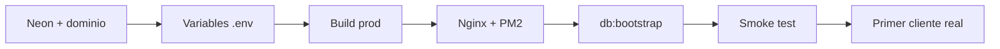

# Tareas para despliegue en producción — AZENDA

Lista de lo que **falta hacer fuera del código** (o en el servidor) para dejar AZENDA en internet con el flujo acordado: **registro → WhatsApp → activación manual por super admin** (sin pasarela de pago).

Complementa [CHECKLIST_PRE_RELEASE.md](CHECKLIST_PRE_RELEASE.md) (validación antes de publicar) y [BACKEND.md](BACKEND.md) (variables del API).

---

## Lo que ya está listo en el repositorio

No hace falta volver a implementarlo para el primer lanzamiento:

| Área | Estado |
| --- | --- |
| Checkout sin pasarela + WhatsApp (`324 566 7724`) | Listo |
| Medios de pago manuales (Nequi + Bancolombia por WhatsApp) | Listo |
| Super admin: cola de activación, plan personalizado, módulos | Listo |
| `environment.prod.ts` + build de producción Angular | Listo |
| `GET /api/health` (incluye ping a PostgreSQL) | Listo |
| `.env.example` (raíz y `api/`) | Listo |
| Cierre de sesión ante JWT expirado / HTTP 401 | Listo |
| Demo y `demo-session` desactivados si `NODE_ENV=production` | Listo |
| `robots.txt` (no indexar `/app`, `/super`, `/contratar`) | Listo |
| CI en GitHub (lint + build + tests API y web) | Listo |

---

## Tareas pendientes (obligatorias para producción)

Marca cada ítem al completarlo.

### 1. Infraestructura y dominio

- [ ] **Elegir hosting** para el API Node y el front estático (SPA). Opciones habituales:
  - **Un VPS** (DigitalOcean, Hetzner, etc.): Nginx/Caddy + PM2/systemd. Máximo control.
  - **PaaS** (Railway, Render, Fly.io): menos configuración de servidor; revisar que permitan Node + archivos estáticos o dos servicios.
- [ ] **Registrar dominio** (ej. `azenda.com` o subdominio `app.tudominio.com`).
- [ ] **Certificado HTTPS** (Let's Encrypt vía Caddy, Certbot o el panel del proveedor).
- [ ] **Base PostgreSQL en Neon** (o el mismo proyecto Neon con branch de producción separado de desarrollo).

### 2. Variables de entorno en el servidor

Copiar desde `api/.env.example` y completar en el entorno de producción (nunca subir `.env` al repositorio):

| Variable | Obligatoria en prod | Notas |
| --- | --- | --- |
| `DATABASE_URL` | Sí | URL de Neon con `sslmode=require` si aplica. |
| `JWT_SECRET` | Sí | Secreto largo y aleatorio; distinto al de desarrollo. |
| `NODE_ENV` | Sí | `production` |
| `CORS_ORIGINS` | Sí | URL exacta del front, ej. `https://app.tudominio.com` (sin barra final). |
| `PORT` | No | Default `3000`; el proxy interno puede usar otro puerto. |
| `AZENDA_DEMO_ENABLED` | No | Dejar sin definir o `false` en producción. |

El API **no arranca** en producción si faltan `JWT_SECRET` o `CORS_ORIGINS` (validación en `api/src/main.ts`).

### 3. Build y artefactos

Ejecutar en la máquina de CI o en el servidor (con Node 20):

```bash
# Desde la raíz del monorepo
npm ci
npm run build -- --configuration=production   # genera dist/azenda/
npm run build:api                             # genera api/dist/
```

- [ ] Build de producción Angular verificado (`dist/azenda/`).
- [ ] Build del API verificado (`api/dist/`).

### 4. Reverse proxy (front + API en el mismo dominio)

El front llama al API en **`/api`** (`environment.prod.ts`). En producción hace falta un proxy que:

1. Sirva los archivos de `dist/azenda/` (HTML, JS, CSS).
2. Reenvíe `/api/*` al proceso Nest (puerto interno, ej. `3000`).
3. Para rutas del SPA (`/app`, `/super`, `/contratar`, …), devuelva `index.html` (fallback).

**Ejemplo mínimo Nginx** (adaptar rutas y dominio):

```nginx
server {
    listen 443 ssl http2;
    server_name app.tudominio.com;

    root /var/www/azenda/dist/azenda/browser;
    index index.html;

    location /api/ {
        proxy_pass http://127.0.0.1:3000;
        proxy_http_version 1.1;
        proxy_set_header Host $host;
        proxy_set_header X-Real-IP $remote_addr;
        proxy_set_header X-Forwarded-For $proxy_add_x_forwarded_for;
        proxy_set_header X-Forwarded-Proto $scheme;
    }

    location / {
        try_files $uri $uri/ /index.html;
    }
}
```

- [ ] Proxy configurado y probado.
- [ ] `CORS_ORIGINS` coincide con la URL pública exacta del front.

### 5. Proceso del API en el servidor

```bash
cd api
NODE_ENV=production node dist/main.js
```

Recomendado con **PM2** o **systemd** para reinicio automático.

- [ ] API corriendo como servicio persistente.
- [ ] `GET https://app.tudominio.com/api/health` responde `{"status":"ok","checks":{"database":"up"},...}`.

### 6. Base de datos (primera vez en producción)

Con `DATABASE_URL` de producción configurada:

```bash
npm run db:bootstrap
```

En producción (`NODE_ENV=production`) esto crea **solo el super admin** si la base está vacía (no tenants demo).

- [ ] Bootstrap ejecutado en la base de producción.
- [ ] Contraseña del super admin (`super@azenda.dev` por defecto en seed) **cambiada** tras el primer acceso o sustituida por un usuario operativo.

### 7. Verificación funcional (smoke test en URL pública)

- [ ] Landing carga por HTTPS.
- [ ] Registro completo: `/contratar` → plan → cuenta → paso pago → WhatsApp → confirmación.
- [ ] Login super admin: `/auth/iniciar-sesion` → `/super/tenants`.
- [ ] Activar un tenant de prueba desde la cola «Pendientes de activación».
- [ ] Cliente activado entra a `/app`.
- [ ] Reserva pública de un negocio con vitrina activa (`/reservar/:slug`).
- [ ] Login con credenciales incorrectas no rompe la app; sesión expirada redirige a login.

Detalle ampliado: [PRUEBAS_SISTEMA.md](PRUEBAS_SISTEMA.md) §4.

### 8. Operación del negocio (día del lanzamiento)

- [ ] WhatsApp **324 566 7724** operativo para confirmar valor, pago y activación.
- [ ] Datos de pago actualizados en código si cambian (`src/app/features/contratar/checkout.config.ts` → `CHECKOUT_MANUAL_PAYMENT`).
- [ ] Super admin con acceso desde un equipo de confianza (no compartir `JWT_SECRET` ni `.env`).

---

## Tareas opcionales (no bloquean el lanzamiento acordado)

Pueden dejarse para después del primer cliente en producción:

| Tarea | Motivo para posponer |
| --- | --- |
| Pasarela Wompi/PayU | Lanzamiento con pago manual + WhatsApp. |
| Docker / docker-compose | No existe en el repo; despliegue directo con Node + Nginx es suficiente. |
| Refresh de JWT | Sesión actual ~12 h; aceptable para piloto. |
| Email transaccional (confirmación reserva) | Hoy solo log en API. |
| Monitorización (Sentry, UptimeRobot, etc.) | Recomendable pronto, no bloquea go-live. |
| CI con PostgreSQL real en e2e | Los e2e actuales no usan Neon. |
| Número de cuenta Bancolombia fijo en UI | Hoy se confirma por WhatsApp. |

---

## Orden sugerido de ejecución



1. Neon producción + dominio + HTTPS  
2. Variables en servidor  
3. Build y despliegue de `dist/azenda` + `api/dist`  
4. Proxy `/api` + servicio Node  
5. `db:bootstrap` + cambio de contraseña super admin  
6. Smoke test en URL pública  
7. Activar primer negocio que espera  

---

## Comandos de referencia rápida

| Acción | Comando |
| --- | --- |
| Build todo para prod | `npm ci && npm run build -- --configuration=production && npm run build:api` |
| Arrancar API prod | `cd api && NODE_ENV=production node dist/main.js` |
| Semilla en base vacía | `npm run db:bootstrap` |
| Health check | `curl -s https://TU_DOMINIO/api/health` |
| CI local (pre-deploy) | `npm run ci` |

---

## Documentos relacionados

| Documento | Uso |
| --- | --- |
| [CHECKLIST_PRE_RELEASE.md](CHECKLIST_PRE_RELEASE.md) | Checklist corto pre-piloto |
| [PRUEBAS_SISTEMA.md](PRUEBAS_SISTEMA.md) | Pruebas por rol y runbook de errores |
| [DESPLIEGUE_PRUEBA_NGROK.md](DESPLIEGUE_PRUEBA_NGROK.md) | Solo demos temporales (no es producción) |
| [BACKEND.md](BACKEND.md) | Variables y prefijos del API |
